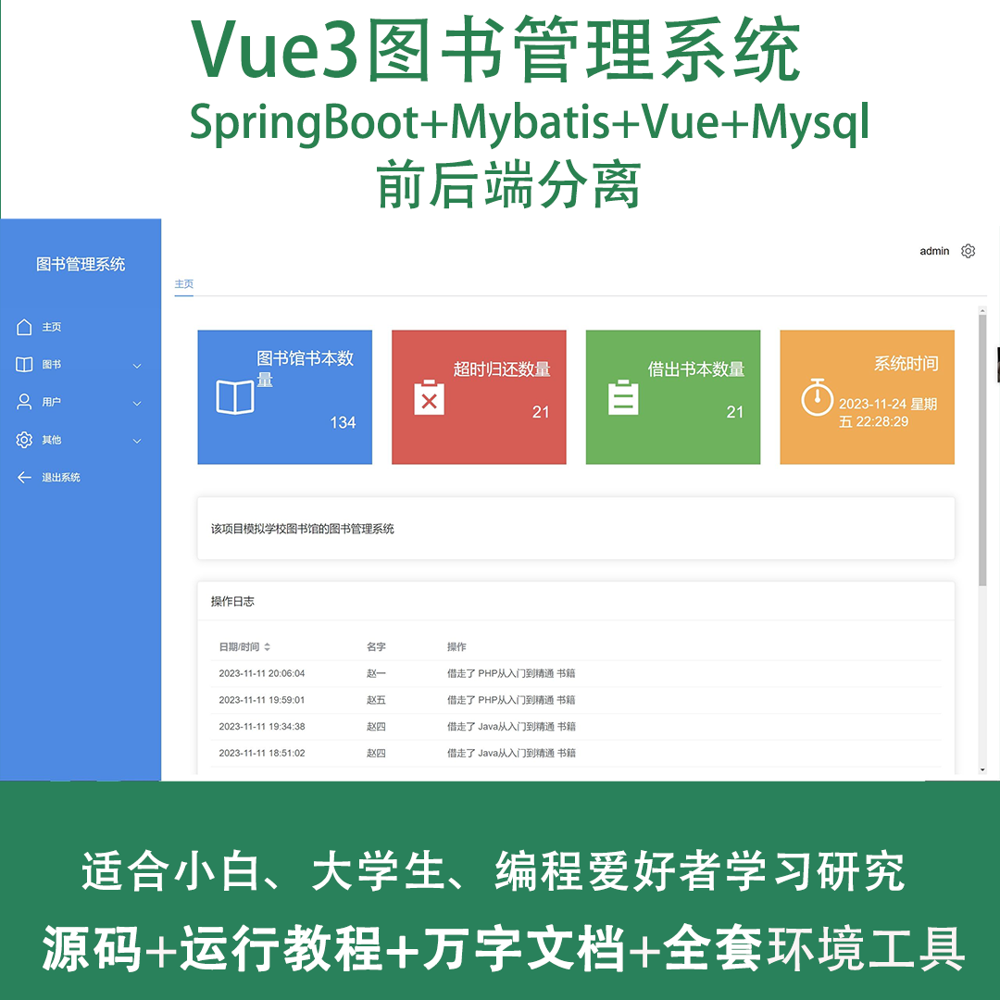
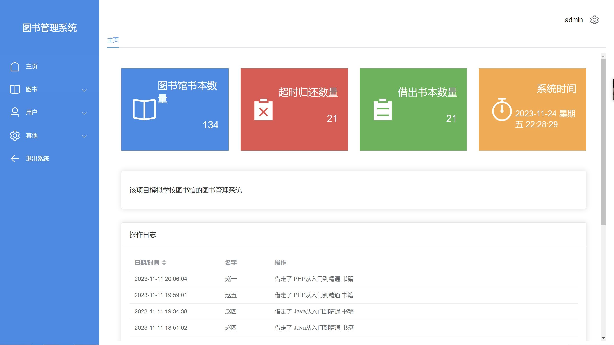
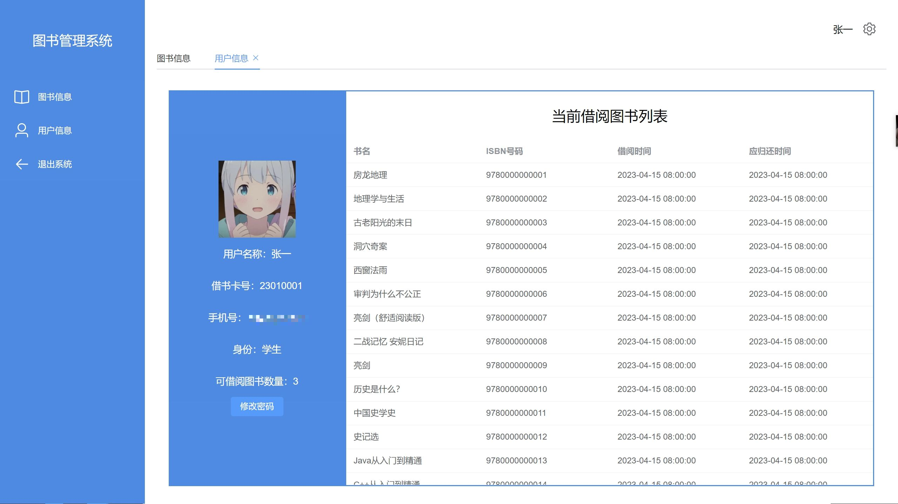
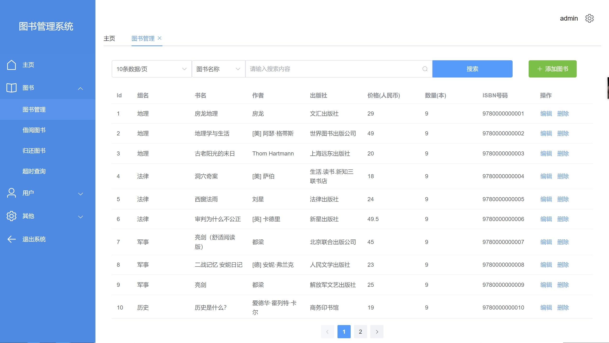
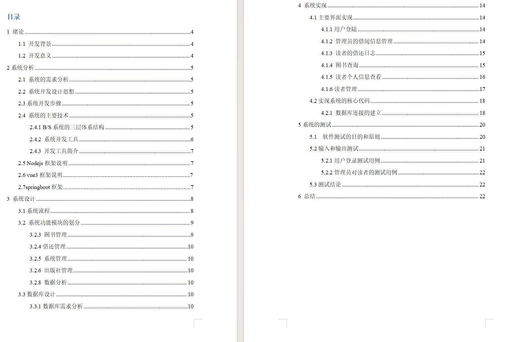
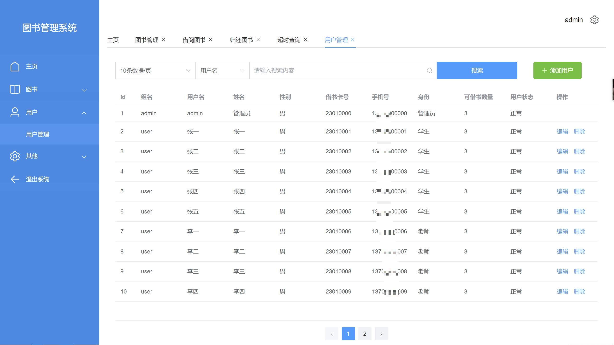
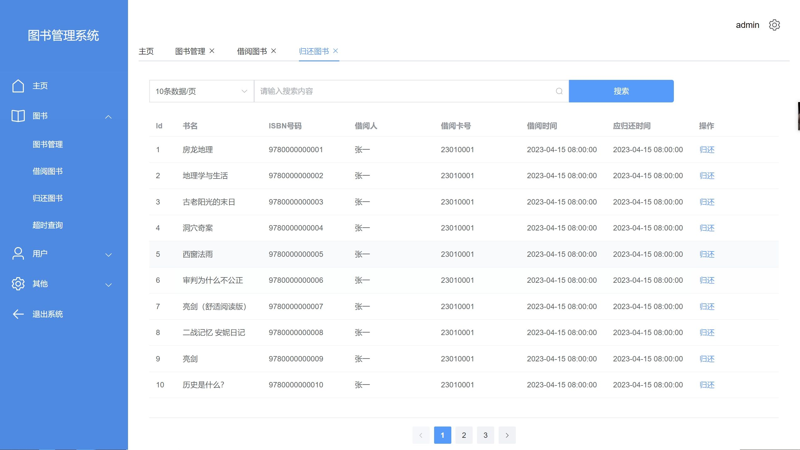
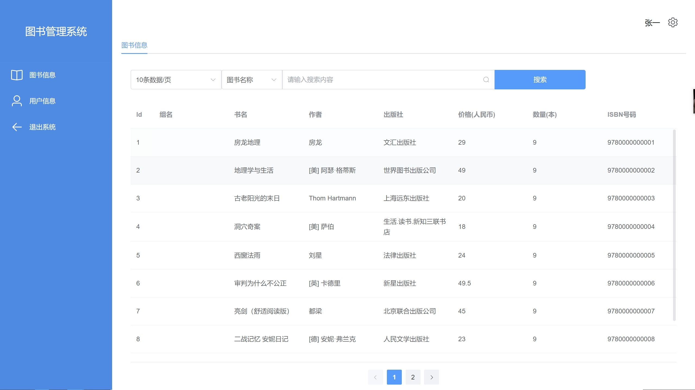
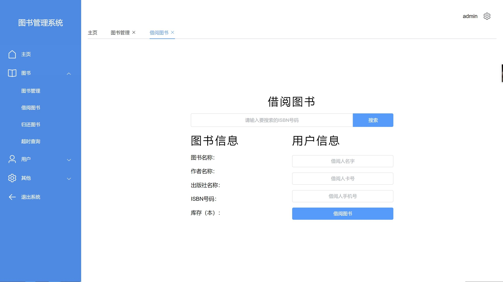

# springbootA345
springbootA345图书管理系统Vue3+LW
 
## 查看主页获取源码

### 一、作品包含

源码+数据库+设计文档万字+全套环境和工具资源+部署教程

### 二、项目技术

前端技术：Html、Css、Js、Vue3、Element-ui

数据库：MySQL

后端技术：Java、Spring Boot、MyBatis

  

### 三、运行环境

开发工具：IDEA

数据库：MySQL8.0

数据库管理工具：Navicat10以上版本

环境配置软件： JDK1.8+Maven3.6.3

前端Nodejs：16

### 四、项目介绍
项目编号：springbootA345

在信息化时代的背景下，图书管理系统作为一种高效、便捷的管理工具，已成为图书馆提高服务质量、优化资源配置的重要手段。它通过对图书的借阅、归还等环节进行智能化管理，不仅极大地方便了读者查找和借阅图书，同时也减轻了图书馆工作人员的工作负担，提升了图书馆的整体管理水平。

角色分类:管理员、教师、学生。
主要功能:
管理员：登录、主页、图书（图书管理、借阅图书、归还图书、超时查询）、用户（用户管理）、其他（系统设置、关于、测试）、退出系统。
教师：登录、图书信息、用户信息、退出系统。
学生：登录、图书信息、用户信息、退出系统。

### 五、运行截图

  
